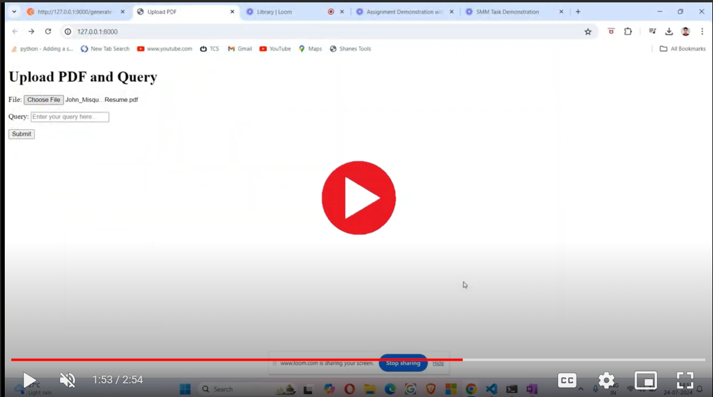

# PDF Chatbot Assignment

## Description and Features

**PDF Text Extraction:** The text is extracted from the PDF file.  
**Text Preprocessing:** The extracted text undergoes preprocessing, which includes converting it to lowercase and removing punctuation.  
**Text Embedding:** The preprocessed text is embedded using a Transformer model.  
**Indexing:** The embedded text is indexed using FAISS  
**User Input:** The main application takes two inputs: a PDF file and a user query.  
**POST Request:** A POST request is generated with the indexed text and the user query, and sent to the FastAPI endpoint.  
**Response Generation:** The GPT model processes the request and generates a response.  
**Display Response:** The response is displayed on the application.  

## 🎥 Watch Video
[](https://drive.google.com/drive/u/0/folders/1RM5AV4OvoYzStK8QC5svQgR9nc6KWhwD)

## Installation

To set up this project locally, follow these steps:

1. **Clone the repository:**
    ```bash
    git clone https://github.com/johnmisquitta/RiDiv-Assignment.git
    ```
2. **Create a virtual environment:**
    ```bash
    python -m venv venv
    ```

3. **Activate the virtual environment:**

     ```bash
     venv\Scripts\activate
     ```

4. **Install packages from requirement.txt:**
    ```bash
    pip install -r requirements.txt
    ```
5. **Generate OpenAI API Key**
   ```
   https://platform.openai.com/settings/profile?tab=api-keys
   ```

6. **Set up environment variables:**
   ```
    Create a `.env` file and add your API Key.
   ```
7. **Navigate to the project directory:**
    ```bash
    cd my-awesome-project
    ```

8. **Run Fast api program file:**
    ```bash
   uvicorn fast_api_endpoint:app --host 127.0.0.1 --port 9000
    ```

9. **Test the endpoint:**  
    Go to postman and download Postman Agent  
    https://www.postman.com/

    Select Post and enter enpoint url
    ```bash
    http://127.0.0.1:9000/generate-response/
    ```

    Go to Body> Raw and select json and paste the below test body

    ```bash
    {
    "query": "capital if India",
    "text_input": "Canada’s capital is Ottawa, while Japan’s capital is Tokyo. Brazil is home to Brasília, and Australia’s capital city is Canberra. France, known for its rich history and culture, has Paris as its capital. South Africa has three capitals: Pretoria, which serves as the administrative capital; Bloemfontein, the judicial capital; and Cape Town, the legislative capital. Germany’s capital is Berlin, and India’s capital city is New Delhi. Italy is centered in Rome, and Mexico City serves as the capital of Mexico."
    }
    ```

    Test if Enpoint is working
10. **Open new vs code Terminal and change directory :**  
```bash
cd my_project
```
11. **Run the APP :**  
```bash
python manage.py runserver
```
   
